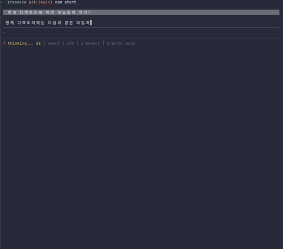

# Presence

**[English](README.md)**

개인 업무 대리 에이전트 플랫폼.



## 빠른 시작

```bash
npm install

# 설정 파일 생성 후 API 키 입력
cp config.example.json ~/.presence/config.json

npm start
```

### 최소 설정

```json
{
  "llm": { "apiKey": "sk-..." }
}
```

로컬 모델(MLX, Ollama 등)도 지원합니다. 자세한 설정은 [GUIDE](GUIDE.ko.md)를 참고하세요.

## 주요 기능

- **Incremental Planning** — LLM이 JSON 계획을 생성하고, Free Monad 프로그램으로 변환하여 실행. 결과를 관찰하고 필요하면 반복.
- **내장 도구 6종** — 파일 읽기/쓰기, 디렉토리 탐색, 웹 페이지 가져오기, 셸 명령, 수식 계산
- **MCP 서버 연동** — 외부 도구를 MCP 프로토콜로 연결
- **메모리** — 대화를 자동 저장하고, 벡터 + 키워드 하이브리드 검색으로 관련 기억을 프롬프트에 주입
- **대화 이력 압축** — 15턴 초과 시 LLM으로 자동 요약 압축
- **토큰 예산 관리** — 프롬프트를 예산 내에서 단계적으로 조립 (시스템 → 이력 → 메모리)
- **승인 시스템** — 파일 쓰기, 셸 명령 등 위험 작업은 사용자 승인 후 실행
- **Multi-Agent** — A2A 프로토콜 기반 에이전트 간 위임
- **Heartbeat** — 주기적 백그라운드 점검
- **터미널 UI** — Ink 기반. 트랜스크립트 오버레이(Ctrl+T), 사이드 패널, 디버그 리포트

## 명령어

| 명령 | 설명 |
|------|------|
| `/clear` | 대화 이력 초기화 |
| `/status` | 현재 상태 |
| `/tools` | 도구 목록 |
| `/models` | 모델 조회/전환 |
| `/memory` | 메모리 관리 |
| `/report` | 디버그 리포트 저장 |
| `/help` | 전체 명령어 + 단축키 |

## 아키텍처

```
User → Incremental Planning Loop → Free Monad Program → Interpreter → Side Effects
                                                                    ↓
                                                          State + Hook → Memory, Persistence, Events
```

- **Free Monad** — 프로그램 선언과 실행의 분리
- **Interpreter** — prod(실제), test(mock), traced(로깅), dryrun(검증)
- **State + Hook** — 상태 변경에 반응하는 부수 효과 격리
- **Either/Maybe** — 에러와 null을 값으로 처리

## 테스트

```bash
npm test    # 1590 tests, 39 files
```

외부 의존성 없이 전부 실행됩니다.

## 문서

- [GUIDE](GUIDE.ko.md) — 설정, 사용법, 트러블슈팅
- [SCENARIOS](SCENARIOS.ko.md) — 실행 가능한 사용 시나리오
- [TESTS](TESTS.ko.md) — 테스트 커버리지 상세
- [PLAN.md](PLAN.md) — 구현 플랜 + 아키텍처 설계

## 기술 스택

- Node.js (ESM)
- [fun-fp-js](https://github.com/loveqoo/fun-fp-js) — Free Monad, Task, Either, Maybe
- [Ink](https://github.com/vadimdemedes/ink) — React 기반 터미널 UI
- [MCP SDK](https://github.com/modelcontextprotocol/typescript-sdk) — 도구 연동
- lowdb — 메모리 영속화
- i18next — 다국어 (ko/en)
